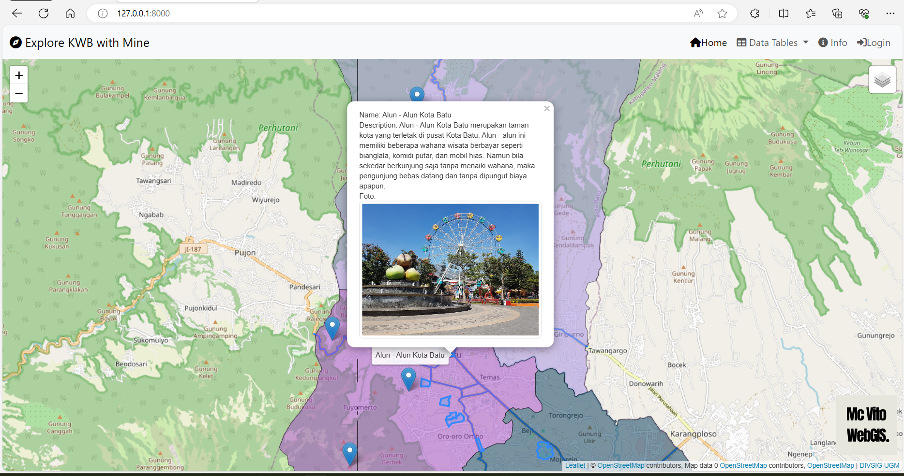
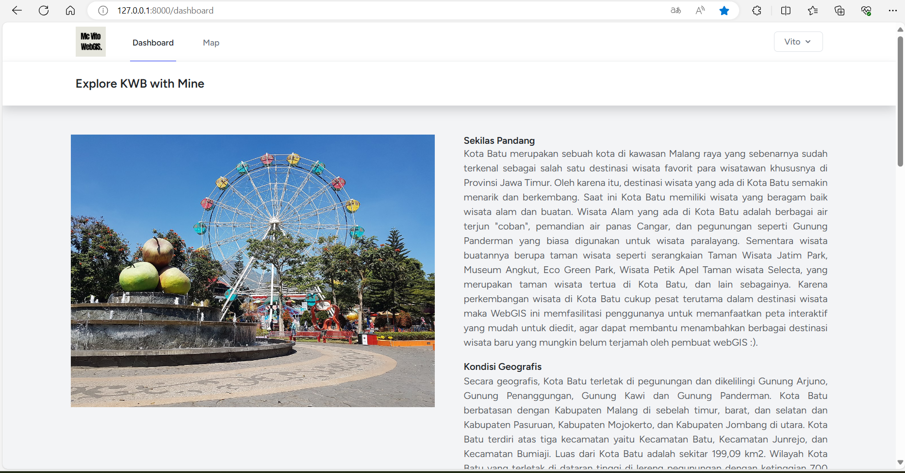
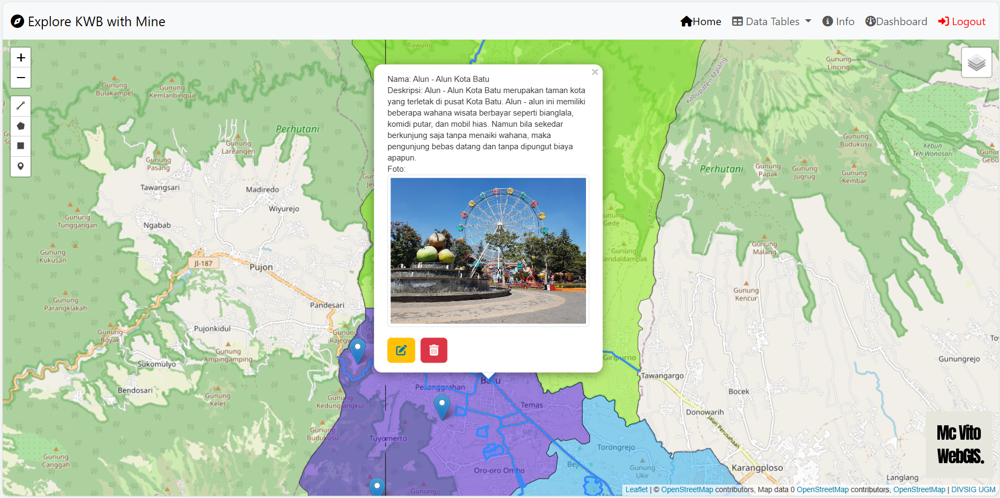
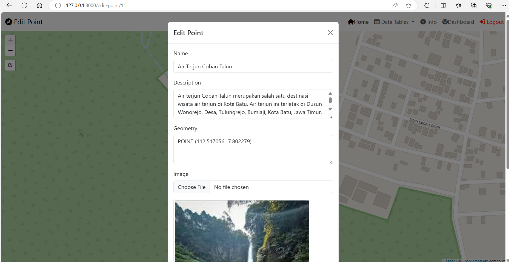
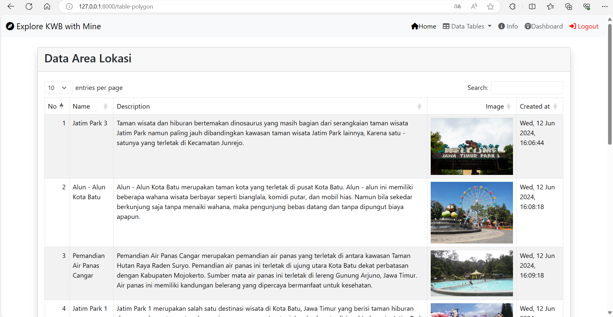

## Explore KWB with Mine 
WebGIS Interaktif untuk Mengenal Tempat Wisata di Kota Batu

**Explore KWB with Mine** *(Baca: Explore Kota Wisata Batu with **Mi**chael **N**o**e**lvito)* merupakan sebuah peta interaktif webGIS yang mengajak penggunanya untuk **mengeksplor lebih jauh** destinasi wisata yang ada di Kota Wisata Batu. Kota Batu merupakan sebuah kota di kawasan Malang raya yang sebenarnya sudah **terkenal** sebagai salah satu destinasi wisata favorit khususnya di Jawa Timur.

**Komponen Pembangun WebGIS :**
* **Laravel** sebagai *framework* atau komponen utama dalam penyimpanan serangkaian kode WebGIS
* HTML sebagai bahasa pemrograman utama untuk halaman index atau web
* Leaflet.js peta dasar penyusun peta interaktif
* Bootstrap komponen web untuk mendesain antarmuka peta interaktif 
* Fontawesome komponen web untuk menambah ikon di samping tulisan

**Sumber Data :**
* Framework Laravel
* Data *Shapefile* Rupabumi Indonesia Administrasi Kecamatan Kota Batu
* Beberapa gambar dan informasi penunjang tempat wisata yang diunduh dan disadur dari pencarian Google secara acak

**Tangkapan Layar :** 
* Halaman Awal

* Dasbor Pengguna

* Peta Interaktif

* Jendela Pembuatan dan Edit Data Geospasial

* Tabel Kumpulan Informasi Data Geospasial

**Didukung Oleh:**

